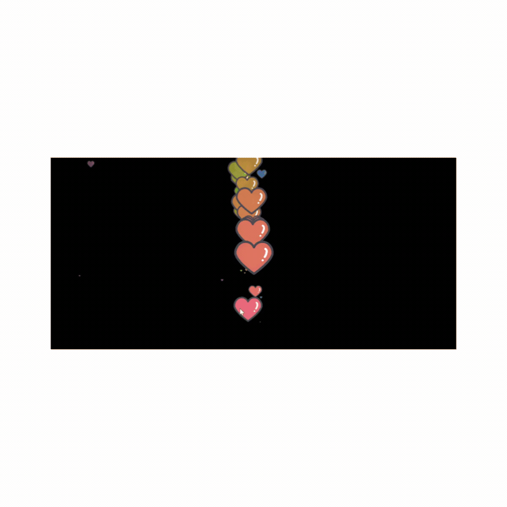

## ❤️ Heart Trail Mouse Effect ❤️

This project includes a charming feature where hearts follow your mouse movement across the screen:

- **🖱️ Mouse Move Listener**: The script listens for `mousemove` events on the body element.
- **❤️ Create Heart**: As you move the mouse, a `span` element is created to represent a heart at each position.
- **📍 Dynamic Positioning**: Each heart is positioned at the current mouse X and Y coordinates.
- **🎲📏 Random Size**: Hearts are generated with a random size, up to 100px, to add visual interest.
- **🧩 Append to Body**: Every heart is appended to the document body, creating a trail effect.
- **⏰✨ Timed Disappearance**: Hearts disappear after 3 seconds, preventing screen clutter.

## 📸 Screenshots 📸

